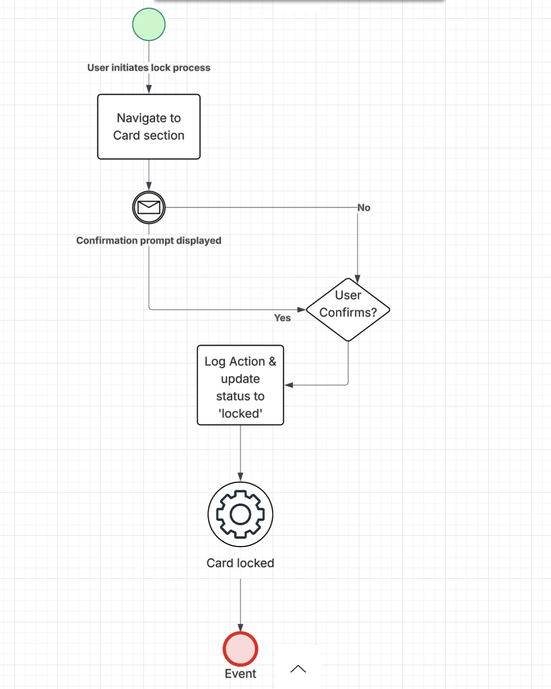

# Process Flows

This section includes the AS-IS and TO-BE flows for the card lock/unlock process.

## TO-BE User Flow Diagram

- User navigates to Card section.

- Chooses "Lock Card"

- Receives confirmation prompt

- Action is logged and status updates to "Locked"
